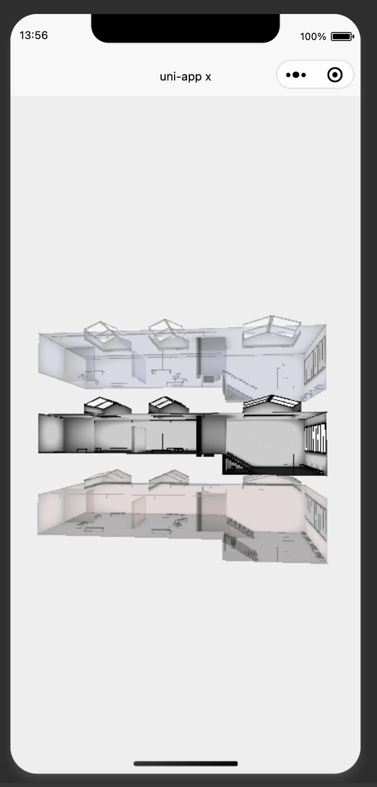

# uniApp Three.js 小程序项目

这是一个基于 uni-app 和 Three.js 的微信小程序项目，用于展示和交互 3D 内容。


## 预览效果

### 3D 场景展示 static/preview/image.png



<!-- ### 模型交互


### 性能展示
 -->

> 注：以上图片仅供参考，实际效果请以小程序体验为准

## 版本说明
### v1.1.0 (2024-05-28)
- 优化 3D 模型加载性能
- 支持h5版本
- h5版本兼容到最新版本（0.176.0）

### v1.0.0 (2024-05-27)
- 初始版本发布
- 支持基础的 3D 场景渲染
- 集成 Three.js 0.57 版本
- 实现微信小程序平台兼容


### 未来版本规划

#### v1.2.0 (计划中)
- 支持更多平台
- 微信小程序兼容到最细版本，现在过于老旧
- 代码封装

 #### v2.1.0 (设想)
- 室内导航


## 项目特点

- 基于 uni-app 框架开发，支持多端运行
- 集成 Three.js 实现 3D 渲染
- 支持微信小程序平台
- 现代化的项目结构和组件化开发

### 版本要求
- uni-app: 3.0+
- Three.js: 0.176.0
- 微信开发者工具: 最新版
- Node.js: 18.0+ 

## 技术栈

- uni-app
- Three.js
- TypeScript/UTS
- Vue 3

## 项目结构

```
├── components/     # 组件目录
├── pages/         # 页面文件
├── static/        # 静态资源
├── utils/         # 工具函数
├── composables/   # 组合式函数
├── jsm_weixin/    # 微信小程序兼容相关模块
└── unpackage/     # 打包目录
```

## 开发环境要求

- Node.js
- HBuilderX
- 微信开发者工具

## 安装和运行

1. 克隆项目
```bash
git clone [项目地址]
```

2. 安装依赖
```bash
npm install
```

3. 使用 HBuilderX 打开项目

4. 运行项目
- 在 HBuilderX 中选择运行到小程序模拟器
- 或使用微信开发者工具打开项目

## 开发说明

1. 页面开发
- 在 `pages` 目录下创建页面
- 在 `pages.json` 中配置页面路由

2. 组件开发
- 在 `components` 目录下创建组件
- 使用 Vue 3 组合式 API 开发

3. 3D 场景开发
- 使用 Three.js 创建和管理 3D 场景
- 在 `jsm` 目录下管理 Three.js 兼容相关模块

## 注意事项

- 确保微信开发者工具已安装并配置
- 注意小程序包大小限制
- 3D 资源需要优化以确保性能

##特别注意
- glft文件不知道为什么加载失败，尽量用glb
- 小程序加载模型只支持http/https协议，其他协议无效
- h5版本支持本地file协议


## 贡献指南

1. Fork 项目
2. 创建特性分支
3. 提交更改
4. 推送到分支
5. 创建 Pull Request

## 作者联系方式

- 微信：z827324885
- 如需定制开发，请通过微信联系我

## 许可证

本项目采用 MIT 许可证 - 详见 [LICENSE](LICENSE) 文件 